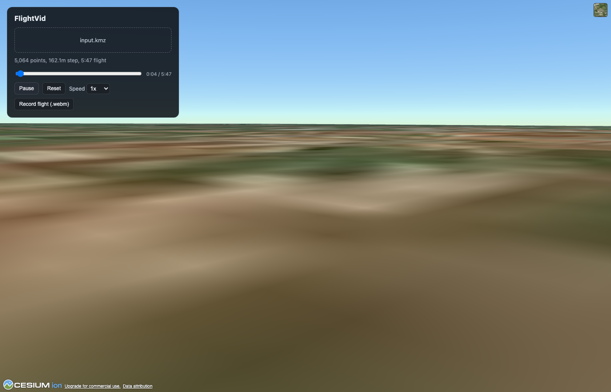

# FlightVid

Turn a drone/aircraft flight plan (`.kml` or `.kmz`) into a flythrough that
shows what the flight would actually see — terrain, satellite imagery, and a
camera that follows the route waypoint to waypoint.

**Live viewer: https://emmett-smith.github.io/FlightPathSim/**



## What it does

Given a flight plan exported from a planning tool (waypoints connected by
`LineString` paths in KML), FlightVid:

1. Extracts the waypoints/lines from the KML (unzipping the KMZ first, if
   needed).
2. Densifies the path — interpolates extra points between waypoints so the
   camera moves smoothly instead of snapping from point to point.
3. Computes a heading at each point from the direction of travel, and
   smooths it so turns don't cause the view to whip around.
4. Flies a camera along the result, as if you were riding along the flight.

There are two independent implementations of that pipeline in this repo:

### `generate_tour.py` — Google Earth Pro

A standalone Python script. Takes `input.kmz`/`.kml`, outputs a `.kml` file
containing a `gx:Tour` that you open in **Google Earth Pro** and play — the
camera flies the route over Google Earth's own terrain and imagery.

```bash
pip install lxml
python3 generate_tour.py
# -> drone_tour.kml, open in Google Earth Pro and press Play Tour
```

The interpolation step size auto-scales to the total path length (capped at
~5,000 waypoints) so long routes don't produce multi-hour, multi-hundred-MB
tours that Google Earth Pro chokes on.

### `webapp/` — browser viewer (this is what's deployed above)

A static web app — upload a `.kml`/`.kmz`, watch the flythrough render live
in the browser, and record it straight to a video file. No server: parsing,
path math, and rendering all run client-side.

- **KMZ/KML parsing & path math** (`src/kml.js`, `src/geometry.js`,
  `src/flightPath.js`) — a JS port of the same densify/smooth pipeline as
  the Python script.
- **Rendering** ([CesiumJS](https://cesium.com/platform/cesiumjs/)) — a
  first-person camera positioned at the drone's actual location and heading,
  flying over real-world terrain and satellite imagery.
- **Video export** (`src/recorder.js`) — captures the canvas via the
  browser's `MediaRecorder` API and downloads a `.webm` of the flight, no
  server-side encoding involved.

Runs entirely as static files, which is why it can be hosted for free on
GitHub Pages via the workflow in `.github/workflows/deploy.yml` (auto-deploys
on every push to `main` that touches `webapp/`).

#### Running it locally

```bash
cd webapp
npm install
npm run dev
```

Get a free access token at [cesium.com/ion](https://ion.cesium.com/tokens)
for full-quality terrain/imagery (otherwise it falls back to Cesium's
shared, rate-limited demo token), and put it in `webapp/.env.local`:

```
VITE_CESIUM_ION_TOKEN=your-token-here
```

## Repo layout

```
generate_tour.py          Python: KMZ/KML -> Google Earth Pro gx:Tour
input.kmz                 sample flight plan used for testing
webapp/                   the deployed browser viewer
  src/kml.js               KMZ/KML parsing
  src/geometry.js          bearing/distance/interpolation/heading-smoothing
  src/flightPath.js        turns parsed segments into a timed camera path
  src/viewer.js            Cesium viewer + first-person camera animation
  src/recorder.js          canvas -> MediaRecorder -> .webm export
  src/main.js              UI wiring (upload, play/pause/scrub, record)
.github/workflows/deploy.yml   builds webapp/ and deploys it to GitHub Pages
```
